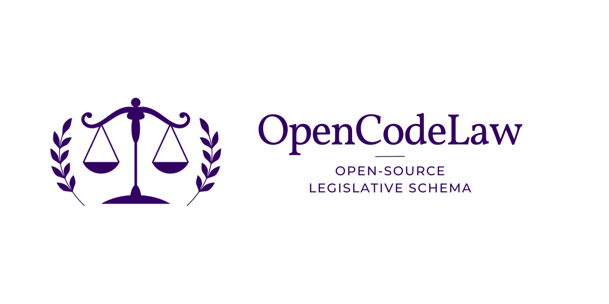

# OpenCodeLaw

<p align="center">
  <a href="https://constitution.stmorg.in"></a>
</p>

OpenCodeLaw is a project that allows you to dynamically generate a constitution page based on YAML specifications. It provides a user-friendly interface for displaying constitution articles and sections.

## Getting Started

To use OpenCodeLaw, follow these steps:

1. Create an HTML file (e.g., `index.html`) and add the following content:

```html
<!DOCTYPE html>
<html lang="en">
  <head>
    <meta charset="UTF-8" />
    <meta name="viewport" content="width=device-width, initial-scale=1.0" />
    <title>OpenCodeLaw Ui</title>
    <!-- Include theme's CSS -->
    <link
      rel="stylesheet"
      href="https://cdn.jsdelivr.net/gh/ServiceToMankind/opencodelaw@1.2.0/css/style.css"
    />
  </head>
  <body>
    <!-- Replace 'YOUR_SPEC_URL' with your own YAML specification URL -->
    <opencodelaw spec-url="YOUR_SPEC_URL"></opencodelaw>

    <!-- Include required scripts -->
    <script src="https://cdn.jsdelivr.net/npm/marked/marked.min.js"></script>
    <script src="https://cdnjs.cloudflare.com/ajax/libs/js-yaml/4.0.0/js-yaml.min.js"></script>
    <script src="https://cdn.jsdelivr.net/gh/ServiceToMankind/opencodelaw@1.2.0/js/opencodelaw.js"></script>
  </body>
</html>
```

2. Replace 'YOUR_SPEC_URL' in the spec-url attribute with the URL of your YAML specification file.

3. Open the HTML file in a web browser to see the dynamically generated constitution page.

## Usage

1. Update the spec-url attribute in the HTML file with the URL of your own YAML specification.

2. The generated page will display the constitution sections and articles based on the provided YAML data.

# OpenCodeLaw YAML Schema Explanation

The OpenCodeLaw YAML schema defines the structure of the constitution for the organization. This schema provides a clear and organized way to outline various sections, articles, and amendments of the constitution. Here's a breakdown of each key in the [schema](https://github.com/ServiceToMankind/OpenCodeLaw/blob/main/schema/opencodelaw.md).

## Contributing

Contributions to the OpenCodeLaw project are welcome! Feel free to fork the repository, make changes, and submit pull requests.

## License

This project is licensed under the MIT License - see the [LICENSE](https://github.com/ServiceToMankind/OpenCodeLaw/blob/main/LICENSE) file for details.
