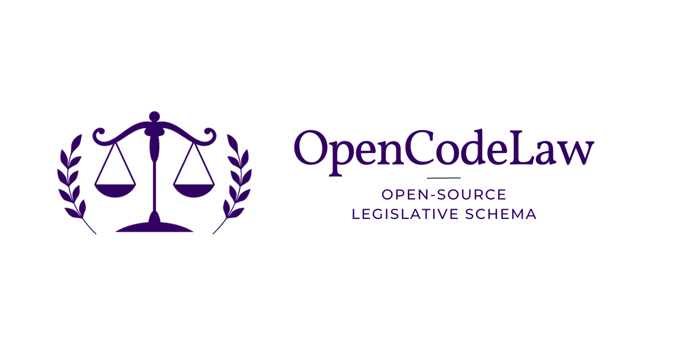

# OpenCodeLaw

<p align="center">
  
</p>

Governance as version-controlled, machine-readable text. You write your constitution
as YAML; OpenCodeLaw validates it and renders a static, searchable, citable website.

It exists because a constitution is not a web page. It is amended by instruments,
cited by number, and read years later — and the tooling around it has to respect that.

**Live example:** the constitution of Service to Mankind Welfare Association,
built from [`constitution/current.yaml`](constitution/current.yaml).

---

## What makes it different

**Citations are permanent.** Every article and section carries an explicit `id` and
`number`. Nothing is derived from position in a list, so reordering the YAML changes
no anchor and no citation. There is a test that proves it.

```yaml
- id: art-21          # permanent, a public URL anchor
  number: 21          # the number Acts cite — explicit, never an array index
  title: Financial Management
```

**Amendments are first-class.** Acts live in a register with their dates, signatures,
the provisions each one touches, and the signed PDF. Provisions link back to the Act
that amended them.

**Unfinished reconciliation is visible, not hidden.** If enacted amendments have not
yet been applied, the document says so in `reconciliation_state`, and every page
renders a banner naming what is outstanding and why. A constitution that quietly
lags its own amendments is the failure this project exists to prevent.

**The validator fails the build, not the website.** A missing or empty provision, a
duplicate id, an unexplained gap in numbering, an Act reference that does not
resolve, or an archived version shadowing the current one — each stops CI. The
predecessor to this tool published a blank Article 11 for two years because nothing
checked.

**The archive is frozen.** Superseded versions are immutable snapshots that reproduce
what was actually published, defects included, each with a canonical link to the
current text and a visible superseded banner.

**No JavaScript required.** Every provision is in the served HTML. Scripts add search,
scroll-spy, theming and copy-links; none of them are needed to read the document.

---

## Requirements

Node **20 or 22**. CI runs both.

> **Node 18 reached end of life in April 2025.** `engines` still allows `>=18.18.0`
> only so the build stays verifiable on the maintainer's current machine. Move the
> local floor to **Node 22 LTS**, and bump `sanitize-html` to `2.17.7` in the same
> change — 2.17.6+ depends on an ESM-only `htmlparser2` that cannot load on Node 18.
> The two fixes it carries (an SVG SMIL `javascript:` bypass, and raw `<` escaping
> `<textarea>`) are unreachable here, because the sanitiser allowlist admits no SVG
> and no animation elements.

## Quickstart

```bash
git clone https://github.com/ServiceToMankind/OpenCodeLaw.git
cd OpenCodeLaw
npm ci

npm run validate     # schema + citation integrity + act cross-references
npm test             # 41 tests, including the built output
npm run build        # renders dist/
npm run linkcheck    # zero internal 404s, nothing escapes the base path
```

Open `dist/index.html`, or serve it:

```bash
npx --yes serve dist -l 8080
```

### Use it for your own organization

Engine (`src/`, `schema/`) is separate from content (`constitution/`, `acts/`).

1. Copy [`examples/starter/constitution.yaml`](examples/starter/constitution.yaml)
   to `constitution/current.yaml` and replace the content.
2. Put your amending instruments in `acts/pdf/` and describe them in
   `acts/register.yaml`.
3. `npx opencodelaw validate` until it passes.
4. Set `BASE_PATH` and `SITE_ORIGIN`, then `npm run build`.

```bash
npx opencodelaw validate constitution/current.yaml
npx opencodelaw build
npx opencodelaw spec        # regenerate schema/SPEC.md
```

Schema reference: **[schema/SPEC.md](schema/SPEC.md)** — generated from
[the JSON Schema](schema/opencodelaw-1.0.schema.json), so it cannot drift.

## Deploying to GitHub Pages

`.github/workflows/deploy.yml` runs `npm ci` → validate → build → link check →
test, then publishes `dist/`. Validation failure blocks deployment.

Enable Pages with **Source: GitHub Actions**, then set the base path:

```yaml
env:
  BASE_PATH: /YourRepo/                        # project Pages
  SITE_ORIGIN: https://yourorg.github.io
```

For an apex domain, set `BASE_PATH: /`, point `SITE_ORIGIN` at your domain, and run
the workflow with `include_cname: true`. The CNAME is excluded by default and CI
fails if it appears without being asked for, so a build cannot silently repoint a
live domain.

## Amending the constitution

Amendments are not edits. A change to provision text requires an instrument, and this repository
carries the pipeline that produces one.

**The bill is the source of truth; the signed PDF is a rendering of it.** An amendment is drafted as
YAML, validated, rendered into the house style of the existing Acts, printed, signed and archived —
and then applied mechanically, because the instrument and the patch are the same object. The three
Acts of 2024 were authored the other way round, as prose applied to the text by hand, which is what
produced a half-applied constitution and fourteen reconciliation questions.

```bash
npx opencodelaw bill new --name my-amendment
npx opencodelaw bill validate bills/2026/my-amendment.yaml   # prints the before/after diff
npx opencodelaw bill render   bills/2026/my-amendment.yaml   # the instrument, for signature
```

Approval is governed by **Article 16(3)**: two thirds of those present and voting in the board, the
intermediate board and the units. All three bodies are required and the pipeline will not enact on
fewer.

| | |
|---|---|
| [process/PROPOSING.md](process/PROPOSING.md) | How to write a bill. Start here. |
| [process/AMENDMENT-PROCESS.md](process/AMENDMENT-PROCESS.md) | Roles, lifecycle, thresholds, versioning. |

## Honest limitations

- **Reconciliation is a human process.** The tools compare texts, classify provisions
  and refuse to guess; deciding what an ambiguous instrument means is not automated
  and should not be. See [RECONCILIATION.md](RECONCILIATION.md) for what that looks
  like in practice.
- **One document per site.** Bylaws, policies and multiple instruments in one build
  are not modelled yet.
- **Amendments are recorded, not applied.** Nothing mechanically rewrites provision
  text from an Act; a person applies the change and the register records it.
- **English only.** No localisation or right-to-left support.
- **OG images need a rasteriser.** Falls back to the brand banner where none exists,
  so the build never fails for it.
- **Slugs come from titles.** Retitling an article changes its page URL. The `#art-N`
  anchor is the stable citation and never moves.

## Documentation

| | |
|---|---|
| [schema/SPEC.md](schema/SPEC.md) | Generated schema reference |
| [CONTRIBUTION.md](CONTRIBUTION.md) | How to work on this |
| [AUDIT-CONFIRMED.md](AUDIT-CONFIRMED.md) | What was broken in the previous version, verified |
| [RECONCILIATION.md](RECONCILIATION.md) | Open legal questions and how they were decided |
| [PROVENANCE.md](PROVENANCE.md) | Every provision compared against the Acts |

## License

MIT — see [LICENSE](LICENSE).
